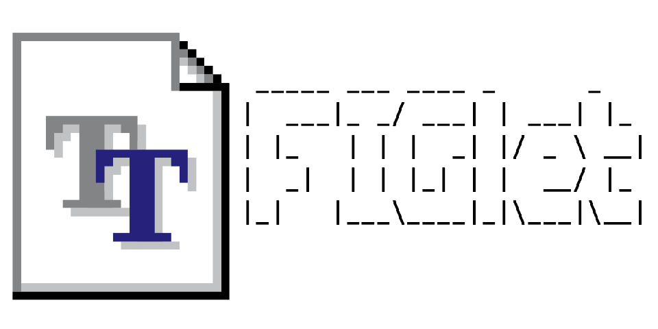

# ttf2flf

Convert TrueType fonts (.ttf) to FIGlet font files (.flf) for ASCII art text rendering.

ttf2flf is a standalone **.NET command-line tool** (`src/ttf2flf`, produces a native
`ttf2flf` binary). It supports two rendering modes:

- **Pixel-perfect mode** (default): true bitmap font rendering using half-block
  characters (▀▄█), auto-detecting the font's native pixel grid
- **Standard mode**: traditional anti-aliased rendering with Unicode block
  characters (░▒▓█)

## Requirements

- .NET 10 SDK to build from source (or download a self-contained binary). Both
  projects target `net10.0`. `global.json` pins SDK `10.0.100` with
  `rollForward: latestFeature`, so any installed .NET 10.0 SDK at feature band 100 or
  later builds the repository; an SDK from another major version is not used.
- Windows, macOS, or Linux

## Installation

```bash
# Clone the repository
git clone https://github.com/jakehildreth/ttf2flf.git
cd ttf2flf

# Build and test everything (ttf2flf.slnx)
dotnet build
dotnet test

# Run from source
dotnet run --project src/ttf2flf -- <font.ttf>

# Or publish a self-contained binary (example: macOS arm64)
dotnet publish src/ttf2flf -c Release -r osx-arm64 --self-contained -o dist/osx-arm64
# Binary is at dist/osx-arm64/ttf2flf
```

`dotnet test` uses Microsoft.Testing.Platform (selected in `global.json`). FIGlet
interoperability tests skip when `figlet` is not on `PATH`; CI installs FIGlet on
Linux and macOS and sets `REQUIRE_FIGLET=1` there so a missing `figlet` fails.

## Usage

```bash
# Pixel-perfect (default): auto-detect grid, minimal height (ceil(span/2) rows)
ttf2flf "PressStart2P.ttf" -o out/

# Convert many at once (several inputs require an output directory)
ttf2flf fonts/*.ttf -o out/

# Pin the render size (skips auto-detection)
ttf2flf "font.ttf" --render-size 17

# Anti-aliased mode (░▒▓█ blocks); --height = terminal rows
ttf2flf "Impact.ttf" --aa --height 12

# Fixed-width output
ttf2flf "font.ttf" --monospace
```

### Options

| Option | Default | Description |
|--------|---------|-------------|
| `-o`, `--output` | same as input | Output .flf path, or a directory. With several inputs it must be a directory (created if missing); a `.flf` path or an existing file is rejected before any conversion. Inputs that would write the same output file (e.g. `a/font.ttf` and `b/font.ttf`) are rejected before any conversion. |
| `--render-size` | auto | Explicit pixel render size (px) |
| `--height` | 8 | Row height (pixel-perfect: px; `--aa`: terminal rows) |
| `--aa` | off | Anti-aliased mode instead of half-block |
| `--monospace` | off | Pad all glyphs to max advance width |
| `--hardblank` | `$` | Hardblank character. Block characters that the selected mode writes (`▀▄█` in pixel mode, `░▒▓█` with `--aa`) are rejected, because FIGlet prints every hardblank as a space. |
| `--units-per-pixel` | auto | Override detection (grid = UnitsPerEm / n) |
| `-v`, `--verbose` | off | Verbose logging |
| `--version` | | Print the version (CalVer) |

### Output shape

**Height is the smallest number of rows that accurately represents the font:**
`ceil(tallest glyph's pixel span / 2)`. A 9px-tall font produces 5 rows, not 4 (odd
spans round up; the dangling top half-block's bottom pixel is simply off). Glyphs are
measured at their true proportional width, bottom-aligned so x-height, capitals, and
descenders keep their correct relationship, and given a 1px right spacer column so
letters stay legible.

### Layout (fitting)

Generated fonts always declare FIGlet **FullWidth** layout (`old_layout -1`,
`full_layout 0`): FIGlet places glyphs side by side, and the 1px spacer inside each
glyph provides the letter gap. There is no layout option. Kerning or smushing does
not suit this geometry, and FIGlet smushes bytes, so it would corrupt the multibyte
block characters. Do not force `figlet -k`, `-s`, or `-S` with these fonts.

### Render failures

A glyph that fails to render becomes a blank glyph with a `[!]` warning. The
conversion fails with exit code 1, and writes no file, when any letter or digit
(`A-Z`, `a-z`, `0-9`) fails, or when more than 10% of the 102 required glyphs fail.

## flfview (font previewer)

An interactive terminal browser for `.flf` fonts. Type a word and it renders live in
the selected font; switch fonts to compare the same word. For FullWidth fonts, output
matches `figlet`'s rendering. flfview does not implement kerning or smushing: fonts
that declare another layout are skipped with a warning.

The build and publish steps copy the bundled corpus beside the executable
(`fonts/verified` from `Corpus/OutputFLF`, `fonts/clean` from `Corpus/FontBookFLF`).
flfview reads those folders by default, so keep `fonts/` next to the binary when you
copy it. `--dir <path>` replaces the defaults with one folder.

```bash
dotnet run --project src/flfview          # interactive
src/flfview/bin/Release/net10.0/flfview   # or the built binary

# Publish a self-contained folder (binary + fonts/); copy the whole folder
dotnet publish src/flfview -c Release -r osx-arm64 --self-contained -o dist/flfview-osx-arm64
dist/flfview-osx-arm64/flfview --fonts
```

| Key / command | Action |
|----------------|--------|
| printable chars | Append to word (live re-render) |
| `Backspace` | Delete the last character (a whole emoji or other supplementary character) |
| `Up`/`Down`, `Tab`/`Shift+Tab` | Previous / next font |
| `PgUp`/`PgDn` | Jump ±10 fonts |
| `/all <word>` | Render the word in every font, paged |
| `/font <name>` | Jump to a font by name |
| `/tier all\|verified\|clean\|approximate` | Filter the font list by quality tier |
| `/fonts` | List all fonts |
| `/clear`, `/help`, `/quit` | — |
| `Esc` / `Ctrl+C` | Exit |

One-shot (scriptable) mode:

```bash
flfview --render "Hello" --font "Jewel 6"
flfview --render "Sphinx" --all
flfview --fonts
flfview --version
```

Fonts are tagged by quality tier: `[v]` verified (bitmap-exact against the author's
reference sheet), `[ ]` clean, `[~]` approximate (decorative/stroked source).

## Pixel-perfect mode details

Pixel-perfect mode uses half-block characters to achieve true pixel-level rendering:

- **█** (U+2588) — both pixel rows ON
- **▀** (U+2580) — top pixel row ON, bottom OFF
- **▄** (U+2584) — top pixel row OFF, bottom ON
- **Space** — both pixel rows OFF

So **2 pixel rows = 1 terminal row**, allowing precise bitmap font rendering.

### Auto-detection

Pixel-style fonts are outline fonts that mimic pixels — they carry no embedded bitmap
strike, so detection works from the font's geometry:

1. **Name hint.** The last number from 5 to 64 in the family name is the design grid
   (e.g., "Jacquard12" → 12, "3270 Pixel 8" → 8). Numbers outside that range, such as
   model or version numbers ("3270 Regular", "SuperMario256"), are ignored. The hint is
   used only if the thinnest stroke of "H" at the matching render size is at most 2 px;
   otherwise ("C64 Pro Mono" on an 8 px font gives 8 px strokes) detection moves on.
2. **Stroke-width alignment.** For thick-stroke fonts, render a probe glyph across
   candidate sizes and measure how often stroke widths are integer multiples of the
   thinnest stroke; the smallest such size is the grid.
3. **Fallback.** Thin-stroke fonts render cleanly at every size and default to 8.

The **render size** is computed separately from the grid as `grid × UnitsPerEm /
capHeightInUnits`, the size at which the rasterizer reproduces the design grid 1:1. The
bundled corpus fonts are calibrated per-font (see `Corpus/render_sizes.json`); override
any font with `--render-size`.

### Manual size selection

When auto-detection produces suboptimal results:

```bash
for size in 8 10 12 15 16 20 24; do
    ttf2flf "font.ttf" --render-size $size -o "test-$size.flf"
    figlet -f "test-$size.flf" "Test"
done
```

Look for the size where characters appear crisp and properly proportioned.

## Output

Generated FLF files include:

- 102 required FIGcharacters (ASCII 32-126 + German characters: Ä Ö Ü ä ö ü ß)
- Comment block with font name, source file, timestamp, and generator version
- Header `MaxLength` equal to the longest glyph-data line in UTF-8 bytes, endmarks
  included (the block characters are 3 bytes each)
- **Pixel-perfect mode:** half-block characters for precise pixel rendering (▀▄█)
- **Standard mode:** Unicode block characters for shading (░▒▓█)

Empty rows at the top and bottom are removed (the minimal-height span), producing
compact FLF files without losing any visual information.

## Using generated fonts

```bash
# With figlet
figlet -f ./myfont.flf "Hello World"

# Or preview with the bundled viewer (--dir selects the folder that holds myfont.flf)
flfview --dir . --render "Hello World" --font "myfont"
```

**Note:** Pixel-perfect fonts with half-block characters require terminal support for
Unicode box-drawing characters. Most modern terminals support this.

## Bundled font corpus

`Corpus/` holds the converted fonts and the reference material used to calibrate the
converter:

- `Corpus/OutputFLF/` — 55 pixel/bitmap fonts converted and verified bitmap-exact
  against each author's reference sheet.
- `Corpus/FontBookFLF/` — additional pixel fonts converted from an installed font
  library (the `name_Xh`/`name_Xp` variants plus extras like 3270, UniVGA16, C64 Pro).
- `Corpus/Reference/` — the authors' reference sprite-sheet PNGs.
- `Corpus/render_sizes.json` — the calibrated per-font render sizes.
- `Corpus/compare_png.py` — the parity harness that compares generated FLF glyphs to the
  reference PNGs: `python3 Corpus/compare_png.py <flf_dir> --corpus-dir <extracted zips>`
  (`--corpus-dir` defaults to `$TTF2FLF_CORPUS_DIR`, then `/tmp/ttfcorpus`).

Browse them all with `flfview`.

`tests/ttf2flf.Tests/Fixtures/PressStart2P-Regular.ttf` is the test font (Press Start 2P,
SIL Open Font License 1.1; see `OFL.txt` beside it). It is the only committed TTF.

## Versioning

Versions use CalVer (`yyyy.M.dHHmm`). The single source is the `CalVer` property in
`Directory.Build.props`; bump it at release, or override it per build with
`dotnet build -p:CalVer=2026.10.11200`. It sets the informational version shown by
`--version` and written to each generated font's `Generator:` comment. Assembly and file
versions carry the same value as `yyyy.M.d.HHmm`, because each .NET assembly version part
is limited to 65535.

## Links

- [FIGlet Font Specification](http://www.jave.de/figlet/figfont.html)
- [SixLabors.Fonts](https://github.com/SixLabors/Fonts)
- [FIGlet](http://www.figlet.org/)

## License

MIT License w/Commons Clause - see [LICENSE](LICENSE) file for details.

---

Made with 💜 by [Jake Hildreth](https://jakehildreth.com)
